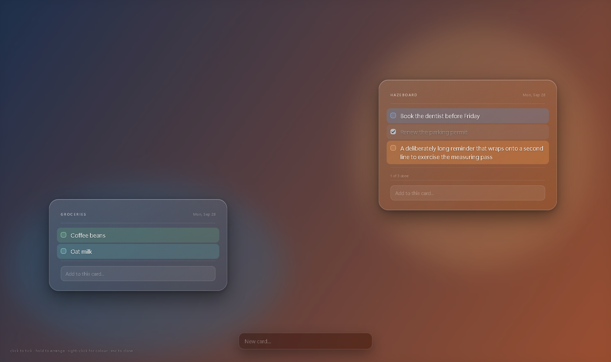

# hazeboard

A whiteboard that lives in your Windows desktop wallpaper. Notes you write are
composited into the wallpaper image itself, so they are simply *there* when you
log in — no process has to be running for you to see them.



## Install

1. Download **`Hazeboard-Setup-<version>.exe`** from the
   [latest release](https://github.com/SUEYTAME/hazeboard/releases/latest) and run it.
   The installer is not code-signed yet, so Windows may say *"Windows protected
   your PC"* — click **More info → Run anyway**.
2. Hazeboard opens your board with a **Welcome** panel and a six-step tutorial
   that moves on as you try each thing (replay it any time: right-click the
   tray icon → **Show tutorial**). From then on:
   - **Ctrl+Alt+W** (or clicking the tray icon) opens and closes the board.
   - Type into **New panel…** at the bottom to make a panel; type into a panel's
     own box to add a note to it.
   - Press **Esc** and your panels are saved into the desktop wallpaper.
3. Hazeboard starts with Windows so the shortcut always works. Turn that off by
   right-clicking the tray icon and unticking **Start with Windows**.

Not sure what to put on it? See **[ideas for using Hazeboard](docs/use-cases.md)**:
to-do lists, shopping, study plans, reminders and more.

## How it works

There are three places you could put something that looks like it's on the
wallpaper. hazeboard uses the first:

1. **Baked into the wallpaper image** — render the notes onto a copy of your
   wallpaper and set that as the desktop background. Zero runtime cost, survives
   reboot/sleep/Show Desktop, visible the instant you log in.
2. A window parented into `WorkerW` (the Wallpaper Engine trick) — live and
   interactive, but needs a resident process and undocumented APIs.
3. An always-on-bottom borderless window — easy, but Show Desktop exposes it.

The glass is real, not faked: the card region is rendered in a browser with
`backdrop-filter` over the actual wallpaper pixels, so the blur samples the
truth.

## Usage

```
npm install
npm run build
```

Drive it from the command line:

```
npm run board -- add "call the bank"   # appends to the first card
npm run board -- list                  # every card and its notes, with ids
npm run board -- cards                 # cards with their positions
npm run board -- done 4f98             # ids may be shortened
npm run board -- rm 4f98
npm run board -- rmcard c982
npm run board -- clear                 # drop completed notes
npm run board -- base "C:/Users/you/Pictures/wallpaper.jpg"
npm run board -- refresh
npm run board -- preview               # render a PNG without touching the desktop
```

…or run it as an app:

```
npm start
```

That puts a tray icon in the notification area. Click it (or press
**Ctrl+Alt+W**) and the whole screen becomes the board: a frozen capture of
your desktop, blurred, with every card floating over it where it sits in the
wallpaper. It is iOS "jiggle to arrange" applied to the whole screen:

- **Click** a note to tick it off. **Right-click** it for a colour.
- **Hold** a note or a card for half a second and the board flips into jiggle
  mode, picking that item up. From then on things drag on movement.
- **Drag a card** anywhere. Positions are stored as fractions of the screen,
  so a resolution change moves cards proportionally instead of off-screen.
- **Drag a note** within its card to reorder it, onto another card to move it
  there, or into empty space to make it a card of its own. A card whose last
  note leaves disappears, like an emptied iOS folder.
- In jiggle mode each note has a **× badge** and a **colour dot**; the dot
  opens a popover with ten tints and a contrast slider. Colour is per note.
- Type into a card's composer to add to it, or into **New card…** at the
  bottom to start one.
- **Esc** closes the popover, then leaves jiggle mode, then closes the board.

The wallpaper is re-baked when the board closes, so the cards you arranged
are exactly where you left them once the overlay is gone.

```
npm run board -- autostart on
```

Starts the tray app at login. Only needed for the tray and hotkey — your notes
appear at login either way, because they *are* the wallpaper.

## Things worth knowing

Each of these cost real debugging time and is easy to trip over again:

- **`IDesktopWallpaper::SetWallpaper` refuses any image under `AppData`**
  (Roaming *and* Local), failing with a flatly misleading `0x80070002`
  "file not found" for a file that is definitely there. Generated wallpapers go
  to `Pictures/Hazeboard` for this reason — note that Electron's default
  `userData` directory is under AppData, so the obvious choice is the one place
  that silently cannot work.
- **Windows caches the wallpaper**, so rewriting the same path can leave the
  desktop showing stale notes. Output alternates between `board-a.png` and
  `board-b.png`.
- **A browser window is clamped to the monitor's work area** (screen minus
  taskbar), so it can never be as tall as the wallpaper. Only the card *region*
  is rendered in the DOM; a `<canvas>`, which has no size limit, composites it
  onto the full-size image.
- **Per-monitor wallpapers need COM.** The old `SystemParametersInfo` call sets
  one image for every screen, which would put a cropped copy of your card on
  the second monitor. `scripts/wallpaper.ps1` uses `IDesktopWallpaper` instead.
- **PowerShell can't call `IDesktopWallpaper` directly** — it dispatches through
  IDispatch, which this IUnknown-only interface doesn't implement. All COM calls
  happen inside the embedded C#.
- **`devicePixelRatio` is not necessarily the display scale factor.** Window
  APIs take DIPs, `getBoundingClientRect` returns CSS pixels, and the two only
  agree when those numbers match. Window sizing converts through physical pixels.
- **Destroying the render window fires `window-all-closed`.** Wiring that to
  `app.exit()` kills the process mid-await, so the wallpaper never gets set —
  and because it's a race, it appears to work about half the time.
- **Cards are baked one at a time, in two passes each.** The window clamp
  above means one render cannot span the wallpaper, and text wrapping means a
  card's height cannot be predicted from its note count: pass 1 lays the card
  out in a full-height window purely to measure it, pass 2 shrink-wraps the
  window and captures. The page refuses to resolve until `innerWidth` and
  `innerHeight` actually match the requested region, because `setContentSize`
  returns long before the renderer sees the new viewport and a capture in that
  gap bakes a card laid out against the *previous* card's height.
- **A frameless window on Windows is 1 DIP larger than the content size you
  asked for** (604×892 requested, 605×893 reported), so the renderer's viewport
  is `ceil((dip + 1) × scale)` — 2px over at 125%. The handshake above allows
  that much slack and the surplus is cropped.
- **Each card is rendered over the composite as it stands, not the clean
  base.** A card's captured region includes its shadow room; pasted over the
  clean base it wipes out any earlier card underneath. Rendered over the
  composite, overlapping cards stack like objects.
- **`fullscreen: true` is silently ignored for a window created with
  `resizable: false`.** A normal window is clamped to the work area even when
  given `display.bounds`, so the overlay must be fullscreen to cover the
  taskbar — and therefore must stay resizable.
- **Windows acrylic was rejected for the overlay.** It exposes no control over
  blur radius, saturation or contrast, and per-note contrast is a feature. The
  overlay blurs a frozen `desktopCapturer` shot instead (166ms at 1920×1200).
  Consequence: video behind the overlay does not animate while it is open.
- **The renderer cannot use ES modules** (CORS-blocked over `file://`), and
  tsc's CommonJS output cannot go in plain `<script>` tags either — every file
  declares `const types_1 = require(...)` in the shared global scope and the
  second one throws. `scripts/copy-assets.js` wraps each module in a function
  scope for a ten-line loader in the html, which is what lets the pages share
  the real `src/shared/*` modules with the main process instead of copies.
- **Ctrl+Alt+W only works while the tray app is running.** A global hotkey
  belongs to a live process; after a reboot with no login item, pressing it
  does nothing and nothing says why. That is why the first launch of an
  installed build turns on *Start with Windows*, and why a failed hotkey
  registration or board open now raises a Windows notification.
- **The installer ships without an asar archive** (`"asar": false`).
  `scripts/wallpaper.ps1` is executed by `powershell.exe`, which cannot read a
  file packed inside `app.asar`.

## Building the installer

```
npm run dist        # -> release/Hazeboard-Setup-<version>.exe
```

## Layout

```
src/main/       Electron main: CLI, tray, fullscreen overlay, compositor
src/renderer/   card.css + card.ts: the card, shared by BOTH the baked
                wallpaper (board.*) and the live overlay (overlay.*), so the
                two cannot drift apart
src/shared/     Types, card geometry (layout.ts) and text shared across the
                boundary - the same pin function places a card in the bake
                and in the overlay
scripts/        PowerShell COM bridge, icon generator, asset/module step,
                overlay check
```

`npm run check` boots the overlay offscreen against a throwaway board, drives
every gesture with synthetic pointer events (click, hold, reorder, move to
another card, detach, move a card, tint, Esc, composers, delete) and
screenshots each state into `tmp/`. Set `HAZEBOARD_CHECK_SHOT=<png>` to use
an image as the desktop instead of a live capture.

## License

Code: [MIT](LICENSE) © 2026 Edgar Homero Sanchez Gonzalez.
Name and brand: "Hazeboard"™ is covered by the [trademark policy](TRADEMARK.md).
